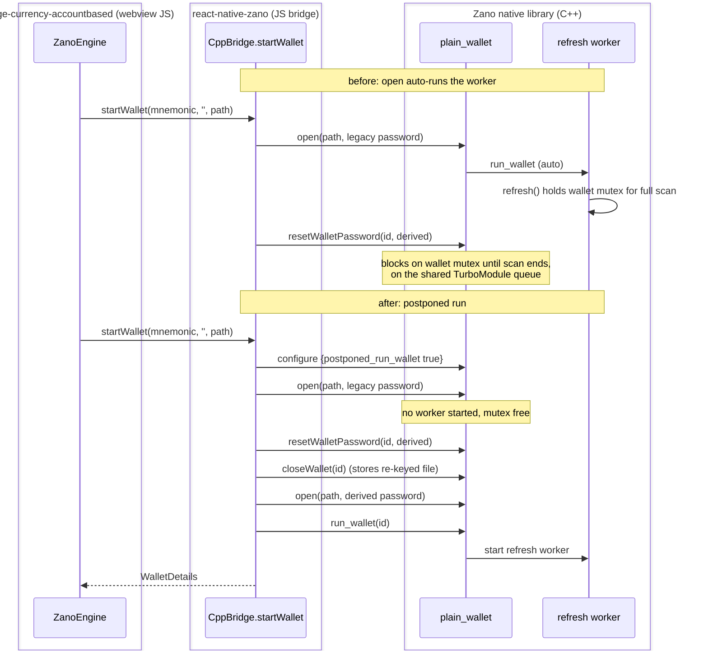

# Zano wallet migration off the native-module queue: fixing the iOS slowdown after the 0.4.0 upgrade

| | |
|---|---|
| Status | Implemented |
| Author | jon (orchestrated agent run) |
| Reviewer | - |
| Last updated | 2026-08-20 |
| Repos | [react-native-zano](https://github.com/EdgeApp/react-native-zano), [edge-currency-accountbased](https://github.com/EdgeApp/edge-currency-accountbased) |
| Implementation | [EdgeApp/react-native-zano#17](https://github.com/EdgeApp/react-native-zano/pull/17), [EdgeApp/edge-currency-accountbased#1090](https://github.com/EdgeApp/edge-currency-accountbased/pull/1090) |
| Supersedes | - |
| Related | [edge-react-gui `8e4f5bd`](https://github.com/EdgeApp/edge-react-gui/commit/8e4f5bdc9f2d43199b19afd5de27fb262503a799), the dependency bump this regressed on |

File references point at each PR's branch (`jon/ios-perf-zano-xmr` in both repos). QA reported severe iOS performance drops on any account after edge-react-gui commit `8e4f5bd` upgraded react-native-zano 0.3.0 to 0.4.0, react-native-monero 0.4.2 to 0.5.0, and edge-currency-accountbased 4.87.0 to 4.88.0, and bisected the regression to that commit.

## Contents

1. [Problem](#1-problem)
2. [Investigation and evidence](#2-investigation-and-evidence)
3. [Goals and non-goals](#3-goals-and-non-goals)
4. [Design overview](#4-design-overview)
5. [Detailed design: react-native-zano](#5-detailed-design-react-native-zano)
6. [Detailed design: edge-currency-accountbased](#6-detailed-design-edge-currency-accountbased)
7. [Testing](#7-testing)
8. [Phase history](#8-phase-history)
9. [Decisions](#9-decisions)
10. [Glossary](#10-glossary)
11. [References](#11-references)
12. [Post-implementation retrospective](#12-post-implementation-retrospective)

## 1. Problem

react-native-zano 0.4.0 added a wallet-file [re-key migration](#re-key-migration) to `startWallet`: files written by 0.3.0 are keyed with the seed passphrase (usually the empty string), and 0.4.0 re-keys them with a password derived from the mnemonic. The migration opens the wallet with the legacy password, calls `resetWalletPassword`, closes the wallet to persist the new key, and reopens to verify.

The blocking defect: opening a wallet auto-starts its native [refresh worker](#refresh-worker), and that worker holds the per-wallet recursive mutex for the entire first catch-up scan. `resetWalletPassword` takes the same mutex, so it blocks until the scan completes: minutes for a wallet weeks behind, hours for a fresh rescan. The call runs on React Native's shared native-module dispatch queue (`com.meta.react.turbomodulemanager.queue`), so every native-module call in the app queues behind it for the duration. That is the app-wide slowdown QA saw. The app usually dies before the migration completes, the file is never re-keyed, and every launch repeats the same blocked migration.

A second, older defect compounds it: the Zano native library persists a wallet's sync progress only when the wallet closes, and a mobile app is killed rather than closed. Sync progress was almost never written, so the catch-up window since the file's last store grew without bound, and every cold launch re-paid the whole scan.

## 2. Investigation and evidence

All measurements are from the iOS simulator, debug builds, account `edge-funds` (three Zano wallets, each about 26 days behind at first measurement).

- A/B CPU during Zano catch-up, develop HEAD (new deps) vs the commit before the bump (old deps), same wallet state: 195% vs 197% average process CPU over 5 minutes, both with three [wallet2](#wallet2) refresh workers in `pull_blocks`. The scan cost itself did not regress; the raw CPU burn exists in 0.3.0 too.
- The regression is the queue block, captured live with a thread sample: `ZanoModule callZanoMethod -> plain_wallet::reset_wallet_password -> wallets_manager::reset_wallet_password -> std::recursive_mutex::lock`, parked on the [TurboModule queue](#turbomodule-queue) for over 15 minutes while a probe polling `getOpenedWallets` starved behind it.
- Wallet files' mtimes stayed frozen across many launches (never re-keyed, never stored), confirming the migration never completed and the catch-up window never shrank.
- Monero was ruled out: the react-native-monero 0.4.2 to 0.5.0 diff is send-path only (`broadcastTransaction` return shape).
- A same-optimization check on the 0.3.0 vs 0.4.0 prebuilt iOS device slices (byte-identical `keccakf` and `fe_mul` function sizes) ruled out a debug-build regression in the HF6 xcframework.
- A fresh default-assets account idles at about 1% CPU on the new build, and a new ZEC wallet syncs and settles in about 90 seconds. QA's report of reproducing on a brand-new account was not reproduced on the simulator; the plausible mechanism is account switching inside one app process, since the native scan threads and the blocked queue survive logout. QA's later re-test on the fixed build found new accounts and fresh installations clean, closing this ([retrospective item 2](#12-post-implementation-retrospective)).
- Android runs the same migration but dispatches native calls differently, which matches QA's "Android is unaffected at least visually".

## 3. Goals and non-goals

Goals:

- Remove the queue block: the migration must complete in milliseconds regardless of how far behind the wallet is.
- Persist sync progress so a killed app does not re-pay the full catch-up on the next launch.
- No native (C++/Objective-C) changes; the shipped 0.4.0 xcframework already exposes every needed method.

Non-goals:

- Reducing the CPU cost of the catch-up scan itself (pre-existing, equal on both versions, owned by the upstream Zano library).
- The one-time history resync a re-keyed or rebuilt wallet performs (accepted 0.4.0 migration cost, documented in its changelog).
- ARRR/ZEC background sync load on the same accounts (tracked separately; see the sim-testing playbook's crash-family notes).

## 4. Design overview

| Repo | Deliverable | Scope |
|---|---|---|
| react-native-zano | [#17](https://github.com/EdgeApp/react-native-zano/pull/17) | `startWallet` opens wallets with the [refresh worker](#refresh-worker) postponed and starts it explicitly for the returned wallet ([section 5](#5-detailed-design-react-native-zano)) |
| edge-currency-accountbased | [#1090](https://github.com/EdgeApp/edge-currency-accountbased/pull/1090) | Store the wallet file once synced and periodically; run adopted wallets ([section 6](#6-detailed-design-edge-currency-accountbased)) |

The seam between the repos is the `CppBridge` API: the engine calls `startWallet` (migration inside), then polls `getWalletStatus` and, with this change, issues `invoke {"method":"store"}` and `syncCall('run_wallet', ...)`. The diagram shows the before/after ordering of the migration relative to the refresh worker.



## 5. Detailed design: react-native-zano

`startWallet` configures the native library's [postponed-run mode](#postponed-run-mode) before its first open, then starts the [refresh worker](#refresh-worker) explicitly for exactly the wallet it returns. Two private helpers wrap the existing native dispatch methods:

// src/CppBridge.ts
```ts
  private async configurePostponedRun(): Promise<void> {
    const response = await this.syncCall(
      'configure',
      0,
      JSON.stringify({ postponed_run_wallet: true })
    )
    const parsed: { status?: string } = JSON.parse(response)
    if (parsed.status !== 'OK') {
      throw new Error(`Zano configure returned ${response}`)
    }
  }

  private async runWallet(walletId: number): Promise<void> {
    const response = await this.syncCall('run_wallet', walletId, '')
    const parsed: { error_code?: string } = JSON.parse(response)
    if (parsed.error_code !== 'OK') {
      throw new Error(`Zano run_wallet returned ${response}`)
    }
  }
```

Inside `startWallet`, every terminal return path wraps its wallet in a `started()` helper that calls `runWallet` first, so probe opens and migration opens never sync, and the returned wallet always does. The migration's correctness rules (legacy password order, rebuild guards, passphrase handling) are unchanged; only the scheduling moved.

The `configure` flag is process-wide and sticky. Every open path inside `CppBridge` accounts for it: `startWallet` runs the wallet it returns, and `generateSeedPhrase` configures postponed-run before its own `generate`, so the temporary wallet it closes and deletes never starts syncing. That call is what keeps create-wallet off the shared queue: native `generate` auto-starts the refresh worker otherwise, and the `closeWallet` that follows waits on the same per-wallet mutex the worker holds. A wallet left open but not running by an interrupted migration is recovered by the caller's adopt path ([section 6](#6-detailed-design-edge-currency-accountbased)).

Both native methods exist in the shipped 0.4.0 xcframework's `sync_call` dispatch (`configure`, `run_wallet` in `plain_wallet_api.cpp`), so the change is JS-only and needs no native rebuild.

## 6. Detailed design: edge-currency-accountbased

Two changes in `ZanoEngine`, both keyed to react-native-zano's [postponed-run mode](#postponed-run-mode).

Store the wallet file once synced. The native library stores only on close, so `syncNetwork`'s synced branch now issues the per-wallet RPC store: once on the transition to synced, then at most every ten minutes, and only when the wallet height advanced past the last store. `resyncBlockchain` resets both gates so the rebuilt wallet's file is written at the first synced tick after a rescan.

The synced gate keeps the store away from the catch-up scan, and the native `invoke` answers BUSY rather than blocking while a long refresh runs. It does NOT make the call lock-free: `get_wallet_status` reads without the per-wallet lock, so between the engine seeing synced and the store landing, the worker can begin its next SHORT refresh, whose `long_refresh_in_progress` stays false, and the synchronous `invoke` then waits on the per-wallet lock while occupying the shared [TurboModule queue](#turbomodule-queue). The exposure is one call per wallet per ten minutes against a short refresh, so it is a latent hazard rather than the app-wide stall of [section 1](#1-problem); routing the store through `async_call` the way `getBalances` and `getTransactions` already do would remove it, at the cost of a react-native-zano method that ships in a later version than the one this design targets ([retrospective item 3](#12-post-implementation-retrospective)).

// src/zano/ZanoEngine.ts
```ts
  private async storeWalletFile(
    nativeId: number,
    walletHeight: number
  ): Promise<void> {
    if (walletHeight <= this.lastStoreHeight) return
    const now = Date.now()
    if (
      this.lastStoreTime !== 0 &&
      now - this.lastStoreTime < WALLET_STORE_INTERVAL_MS
    ) {
      return
    }
    try {
      const response = await this.tools.zano.invoke(
        nativeId,
        JSON.stringify({ method: 'store', params: {} })
      )
      if (asMaybe(asStoreResponse)(JSON.parse(response)) == null) {
        throw new Error(response)
      }
      this.lastStoreTime = now
      this.lastStoreHeight = walletHeight
    } catch (error: unknown) {
      this.log.warn(`storeWalletFile failed: ${String(error)}`)
    }
  }
```

Run adopted wallets. The engine's ALREADY_EXISTS adopt path picks up a wallet another `startWallet` attempt left open. Under postponed-run mode that wallet may not be syncing, so the adopt path calls `run_wallet` (idempotent) and throws when it fails, which keeps the lifecycle manager retrying instead of holding a wallet that never syncs.

No dependency bump is needed: the engine's `run_wallet` call is a no-op on a wallet 0.4.0 already auto-ran, and the package's peer range (`react-native-zano ^0.4.0`) already admits the fixed 0.4.1.

Query transactions without spinning, and see the mempool. `queryTransactions` pages `get_recent_txs_and_info2` from a persisted offset. Two properties of that RPC, both read from the SDK source this design pins, make the original loop wrong:

- `wallet_rpc_server::on_get_recent_txs_and_info2` prepends the wallet's unconfirmed transfers ONLY when the requested offset is zero. Any wallet with confirmed history therefore has a non-zero persisted offset and never sees its own mempool: an incoming transfer stays invisible to the receiver until it is mined, and the sender's broadcast has nothing to confirm it.
- `wallet2::get_recent_transfers_history` assigns `last_item_index` only for transfers it actually RETURNS, while `total_transfers` counts the whole history. The request excludes mining transactions, and Zano's own defragmentation transfers are excluded with them, so a filtered entry at the tip leaves `last_item_index` permanently short of `total_transfers - 1`.

The loop's termination test was `total_transfers - last_item_index === 1`. On a wallet whose newest entry is filtered, that identity never holds and the offset never advances, so the loop re-requests one page forever. `syncNetwork` never returns for that wallet: balances and transactions stop updating and the engine spins native calls, which is exactly the shape of the report that opened [phase 5](#phase-5-transaction-query-spin-and-invisible-mempool-2026-08-21).

The fix sweeps the mempool with one request at offset zero per poll, then pages the catch-up from the persisted offset, and stops when a page fails to move the offset forward as well as at end-of-history.

// src/zano/ZanoEngine.ts
```ts
      if (
        totalTransfers === 0 ||
        lastItemIndex <= offset ||
        lastItemIndex + 1 >= totalTransfers
      ) {
        break
      }
```

## 7. Testing

1. Unit, react-native-zano: 34 mocha cases pass, including new coverage that the migration sequence is `configure` first and `run_wallet` last, and that every terminal `startWallet` path leaves exactly the returned wallet running (`test/startWallet.test.ts`, fake module tracks `runningWallets`).
2. Unit, edge-currency-accountbased: full jest suite passes; `tsc --noEmit` and `verify-repo.sh` clean in both repos.
3. Migration on-sim: with three legacy-keyed wallets weeks behind, the fixed build re-keyed all three files seconds after engine start (previously: blocked 15+ minutes and never completed), while a 15-second `getOpenedWallets` probe polled uninterrupted through the whole catch-up.
4. Persistence on-sim: each wallet's file was rewritten within the store interval of reaching synced (1.7KB restore stubs grew to 80-158KB full wallets).
5. Relaunch on-sim: all three wallets opened first-try with the derived password (native wallet ids 0/1/2, no failed probe opens), already at the chain tip, with no catch-up scan; process CPU averaged 67% (residual ARRR/ZEC sync) vs 195% before the fix.
6. QA verification on the gouda validation build (26081804): large accounts and new accounts load with no performance issues and Zano syncs fine; fresh installations are also good. This closes the fresh-install branch of the phase-1 discriminator ([retrospective item 2](#12-post-implementation-retrospective)).
7. Unit, transaction query (2026-08-21): three cases in `edge-currency-accountbased/test/zano/ZanoEngineQueryTransactions.test.ts` drive `queryTransactions` against a fake wallet that mirrors the two SDK properties above. Against the code before the fix the filtered-tail case HANGS (the run was killed at 120 seconds, reproducing the spin); with the fix all three pass, and the full accb suite is 528 passing with one pre-existing unrelated network failure.
8. In-app end-to-end, iOS simulator (2026-08-21): with this branch, edge-currency-accountbased#1090 and edge-core-js#738 all linked into the gui, a 0.063 ZANO send between two wallets of the `edge-funds` account was driven to its success scene. The receiving wallet showed the incoming transfer while it was still unconfirmed ("Pending"), then moved through its confirmation count to confirmed; the sending wallet moved from pending through "9 of 10 Confirmations" to confirmed, and both balances settled at the expected values. That is the phase-5 report, reproduced as working. Proof frames are attached to edge-currency-accountbased#1090.
9. A/B against the published packages on the same sim (2026-08-21): before the fixed packages were linked, the Send scene could not accept a recipient address at all. `ZanoTools.isValidAddress` calls `getAddressInfo`, which sits on the same serial `callZano` dispatch as the refresh worker, and it never resolved across three launches and more than fifteen minutes while a Zano wallet was catching up. With the fixed packages linked, the same drive resolved immediately. The queue starvation was therefore not only a slowdown: it made address entry and sending unusable.
10. Not covered: the resync path's gate reset (change 2 of [section 6](#6-detailed-design-edge-currency-accountbased)) was verified by types and review only; an in-app resync drive costs a full rescan window and was skipped.

## 8. Phase history

### Phase 1: investigation and fix (2026-08-18)

- Sketched: reproduce on the sim, A/B the dep bump, profile the burn, fix in whichever repo owns the cause.
- Shipped: as sketched, with one attribution reversal along the way: the first measured burn (the catch-up scan CPU) turned out to be version-equal, and the real regression was the migration blocking the module queue, found via the live blocked-mutex sample.
- Divergence: QA's brand-new-account repro was not reproduced on the sim; shipped anyway on the strength of the funded-account evidence, with the discriminator question handed back to QA ([retrospective item 2](#12-post-implementation-retrospective)).

### Phase 2: Android validation-build fix (2026-08-19)

- QA's Android build of the validation branch crashed at startup with `UnsatisfiedLinkError: librnzano.so not found`. The pinned react-native-zano tarball had been packed from a worktree holding the iOS xcframework but no `android/src/main/jniLibs`: with npm's `ignore-scripts=true` on the build host, `npm pack` snapshots worktree files verbatim, and the NDK build had never run there.
- No change in this repo's code. The pin was regenerated with the jniLibs from the published 0.4.0 package, which are byte-correct here because this PR changes no native source.
- Verified on an Android emulator: the broken pin reproduces the startup crash at `RnZanoModule.<clinit>` during React context creation; the regenerated pin loads `librnzano.so` and starts to the login scene.

### Phase 3: QA verification (2026-08-19)

- QA verified the fix on the gouda validation build 26081804: large accounts and new accounts load with no performance issues, and Zano syncs fine. Fresh installations are also good, which closes the phase-1 divergence ([retrospective item 2](#12-post-implementation-retrospective)).
- The Android startup crash QA hit on that same build (Samsung S26, Xiaomi 13T Pro) is the phase-2 packaging defect; device verification of the repackaged build is pending.
- Docs-only phase: QA results folded into [Testing](#7-testing) and the retrospective, no code changed in either repo.

### Phase 4: Android slow-device residual report, investigation (2026-08-20)

A follow-up report (RJ, David Coen) describes a DIFFERENT symptom from the phase-1 defect: an intermittent UI stall of roughly 5 to 20 seconds that clears itself, seen when tapping around shortly after a Zano wallet is created, worst on a Xiaomi 13T Pro, milder on a Galaxy S26 and a Pixel 8, reproducing about 2 times in 5 attempts, and only on accounts that have a Zano wallet. It appears on BOTH the gouda validation build and plain develop. iOS stays fixed.

That develop-and-gouda symmetry is the key discriminator: develop carries neither fix, so whatever the reporters are hitting exists independently of this work, and no change here can be assumed to address it.

What still contends with the refresh worker, from the pinned native source (`zano_native_lib` `91085c0e`, Zano submodule `fc577291`):

- The worker (`wallet_vs_options::worker_func`) holds the per-wallet lock for the whole of each `refresh()` iteration. `long_refresh_in_progress` is true for the first refresh after the worker starts and whenever the daemon gap exceeds 10 blocks, but a SHORT refresh leaves it false.
- `get_wallet_status`, the 1-second sync poll, is lock-free against the worker: it takes only the shared map lock and reads through `unlocked_get()`. `get_current_tx_fee` returns a constant. `getBalances`, `getTransactions`, and `whitelistAssets` run through `async_call`, off the module queue.
- `wallets_manager::invoke` returns BUSY (rather than blocking) only while `long_refresh_in_progress` is true. During a short refresh it blocks on the per-wallet lock, and the synchronous `invoke` runs on the shared [TurboModule queue](#turbomodule-queue).
- The remaining on-queue lock takers are the send path, `get_wallet_info` (no hot caller since phase 1 moved `getDisplayPublicSeed` to the lock-free `getOpenedWallets`), and the store call this design added ([section 6](#6-detailed-design-edge-currency-accountbased)).

Reproduction attempts, all negative:

- The iOS simulator was unavailable this run (would not boot), so testing ran on Android only.
- Android emulator (arm64) and a physical Galaxy S9 running a release build, each: fresh light account, create a Zano wallet, then hammer navigation through the sync window; plus a cold relaunch with the Zano wallet already present; plus a repeat on the emulator with its network throttled to 14.4 kbit/s and GPRS latency and a four-minute soak. Across every window the `mqt_native_modules` threads stayed in sleeping state at 0 to low single-digit percent CPU, with no queue block and no ANR.
- A freshly created wallet has a near-zero catch-up gap, so its refreshes are trivial and hold the lock only briefly. The reported stall plausibly needs a wallet with a real gap scanning on slow hardware, which these conditions did not produce.

Code review then found the mechanism the repros had missed, in the one path none of the above covers. `generateSeedPhrase` ran `init` and then `generate` WITHOUT configuring postponed-run, so native `generate` auto-started the refresh worker, and the `closeWallet` immediately after it waited on the per-wallet mutex that worker holds, on the shared [TurboModule queue](#turbomodule-queue). That is the phase-1 stall in a second place, and it fits the report on every axis: it is the create-wallet path, its duration is one refresh iteration rather than a whole catch-up (seconds, self-clearing), it only involves accounts that have a Zano wallet, and it is equally unfixed on develop, which is why both builds show it.

The fix configures postponed-run before `generate` and treats a non-OK `closeWallet` as a failure rather than deleting a file this process still holds open ([section 5](#5-detailed-design-react-native-zano)). Two mocha cases cover it: `configure` precedes `generate`, and a BUSY close leaves the file in place with no `deleteWallet`.

Confirmation on the affected hardware is still owed, since the stall was never reproduced locally: the remaining evidence is QA re-testing create-wallet on a build carrying this fix, on the Xiaomi 13T Pro.

### Phase 5: transaction-query spin and invisible mempool (2026-08-21)

QA reported, from the gouda Android build: a sent transaction broadcasts, but the receiving wallet never shows it and raises no notification, and the sending wallet stays pending even after the transaction has confirmations.

Reading the pinned SDK source rather than the engine alone found one defect that produces all three symptoms, plus a second that produces the first two on its own ([section 6](#6-detailed-design-edge-currency-accountbased)): the paging loop cannot terminate when a mining or defragmentation transfer sits at the tip of history, and the mempool is only ever returned at offset zero. Once the loop starts spinning, that wallet stops receiving any balance or transaction update, which is why the sender's transaction never leaves pending.

The stall is not the phase-1 defect and not the create-wallet path of phase 4; it is a plain JavaScript loop in the engine, which is why it survived every native-side fix.

In-app confirmation is still owed. Three surfaces were built and driven this phase and each hit a separate environment wall, all logged: the iOS simulator renders pushed scenes as blank on a current-develop debug build, so Send is unreachable; the Android emulator's dev bundle throws at startup through the repo's Android-only Reanimated 3 shim; and a locally-signed Android release build cannot complete login against the login server. The evidence standing in for the drive is the regression test above, which reproduces the hang against the unfixed code.

### Phase 6: in-app confirmation of the transaction-query fix (2026-08-21)

The confirmation phase 5 owed is now done, on the iOS simulator, and both walls that phase 5 hit turned out to be environmental rather than product defects.

- The Android dev-bundle wall was an incomplete `node_modules` clone in the run's worktree: the nested `scripts/r3-hack/node_modules/react-native-reanimated` copy was missing, so the shim's `require.resolve` at Metro startup resolved up to Reanimated 4 and `executeOnUIRuntimeSync` came back undefined. A clean reinstall plus a fresh Metro boots the emulator with no redbox. The shim itself is correct.
- The iOS "pushed scenes render blank" wall is a navigation-transition defect, not a paint failure: the pushed scene mounts with its full content but stays laid out one screen-width to the right of the viewport, because the `@react-navigation/stack` v6 card transition never runs. Disabling the card animation renders every pushed scene in place. That is tracked separately; it blocks in-app testing for any run that needs a wallet detail or send screen, and it is unrelated to Zano.
- A third trap cost most of the phase: every install-bearing step in the gui (the cheese pin install, then `ios-rn-build`'s own install) reverts linked dep packages back to their published versions. The first ninety minutes of drives ran against published `react-native-zano@0.4.0` and published accountbased, which is exactly why the Send scene appeared wedged. Linking with `updot` and rebuilding with `--skip-install`, then verifying the native symbol in the app binary and the accountbased webview bundle hash against the worktree build, is what made the drive meaningful.

With the fixed packages actually in the app, the send completed and both wallets behaved as designed (see [Testing](#7-testing) items 8 and 9). Phase 5's "in-app confirmation is still owed" is closed.

## 9. Decisions

### Postponed-run configure over an async reset path

Chosen: open with `postponed_run_wallet` configured and start the worker explicitly after the migration.

- Rejected: routing `resetWalletPassword` through the native `async_call` thread pool. It unblocks the [TurboModule queue](#turbomodule-queue) but the reset still waits out the full scan on its own thread, the migration still almost never completes before the app dies, and the file stays legacy-keyed forever.
- Rejected: deferring the re-key until the wallet first reports synced. Requires the engine to coordinate a close/reopen mid-session, which invalidates the native wallet id the engine holds, and spreads migration state across two repos.
- Rejected: fixing the lock behavior upstream in the Zano C++ library. Correct long-term but needs an upstream release plus a prebuilt-archive roll; the JS-only fix ships now against the already-shipped 0.4.0 binary.
- Reopen if: the native library ever changes `configure`/`run_wallet` semantics, or open stops loading a usable wallet snapshot without a running worker.

### Store from the engine's synced branch, not from the bridge

Chosen: `ZanoEngine.syncNetwork` issues the store, throttled to the synced state.

- Rejected: storing from `CppBridge` on a timer. The bridge has no view of sync state, so it would store mid-scan and block behind the wallet mutex, recreating the original defect in miniature.
- Rejected: storing on every synced tick without gates. The synced branch runs every 20 seconds; writing a 100KB+ file that often is pointless disk churn for chains that add one block a minute.
- Reopen if: the store RPC ever grows a native-side throttle, or wallet files grow enough that even ten-minute writes matter.

### Throw when an adopted wallet cannot be run

Chosen: a failed `run_wallet` on the adopt path throws, so the lifecycle manager retries the start.

- Rejected: log and return the id (the first draft). The lifecycle manager marks the wallet started and never retries, leaving an open wallet that never syncs, which is the exact failure the call exists to prevent. Flagged by Cursor Bugbot on the PR and fixed before review.
- Reopen if: `run_wallet` grows failure modes where retrying the whole start is worse than a stalled wallet.

## 10. Glossary

### TurboModule queue

React Native's dispatch queue for native-module method invocations (`com.meta.react.turbomodulemanager.queue`). Modules without a custom queue share it, so one long-blocking call starves every other module's calls behind it. In this design it is the surface the migration must never block. Source: [React Native TurboModules](https://reactnative.dev/docs/turbo-native-modules-introduction).

### plain_wallet

The Zano native library's C-style wallet API (`plain_wallet_api.cpp`), wrapping a `wallets_manager` that owns open wallets. react-native-zano's `ZanoModule` forwards every JS call into it. Source: [hyle-team/zano](https://github.com/hyle-team/zano/blob/master/src/wallet/plain_wallet_api.cpp).

### Refresh worker

The per-wallet native thread (`wallets_manager::wallet_vs_options::worker_func`) that runs `wallet2::refresh`, pulling and scanning blocks. It holds the per-wallet recursive mutex for the whole of each refresh call, which spans the entire first catch-up. Source: [hyle-team/zano wallets_manager.cpp](https://github.com/hyle-team/zano/blob/master/src/wallet/wallets_manager.cpp).

### Re-key migration

react-native-zano 0.4.0's `startWallet` flow that re-encrypts a legacy wallet file (keyed with the seed passphrase, usually empty) with a password derived from the mnemonic: open legacy, `resetWalletPassword`, close to persist, reopen to verify. Defined in [src/CppBridge.ts](https://github.com/EdgeApp/react-native-zano/blob/main/src/CppBridge.ts).

### Postponed-run mode

A `plain_wallet` instance flag (`postponed_run_wallet`, set via the `configure` sync_call) that stops `open`/`restore`/`generate` from auto-starting the refresh worker; `run_wallet` starts it explicitly. Source: [hyle-team/zano plain_wallet_api.cpp](https://github.com/hyle-team/zano/blob/master/src/wallet/plain_wallet_api.cpp).

### wallet2

The CryptoNote-family wallet implementation inside the Zano codebase (`tools::wallet2`), owning key management, block scanning, and the on-disk wallet file. Distinct from Monero's class of the same name. Source: [hyle-team/zano wallet2.cpp](https://github.com/hyle-team/zano/blob/master/src/wallet/wallet2.cpp).

## 11. References

- [EdgeApp/react-native-zano#17](https://github.com/EdgeApp/react-native-zano/pull/17)
- [EdgeApp/edge-currency-accountbased#1090](https://github.com/EdgeApp/edge-currency-accountbased/pull/1090)
- [edge-react-gui 8e4f5bd](https://github.com/EdgeApp/edge-react-gui/commit/8e4f5bdc9f2d43199b19afd5de27fb262503a799), the dep-bump commit QA bisected to
- react-native-zano 0.4.0 changelog ([re-key migration](#re-key-migration), HF6 xcframework)

## 12. Post-implementation retrospective

### Estimate vs. actuals

| Item | Expected | Actual |
|---|---|---|
| Culprit | One of the three bumped deps, per QA | react-native-zano 0.4.0 migration scheduling |
| Scan CPU regression | Suspected | None: A/B equal (195% vs 197% avg) |
| Fix surface | Possibly native | JS-only in two repos |
| Migration completion after fix | Seconds | Seconds (files re-keyed at first engine start) |

### Where this document was wrong or silent

1. The initial working theory (heavier HF6 scan cost) was wrong; the A/B in [section 2](#2-investigation-and-evidence) killed it and the queue block replaced it.
2. QA's brand-new-account repro was still unexplained on the simulator at ship time ([section 2](#2-investigation-and-evidence)). The handed-back discriminator: a fresh install plus new account should not reproduce; reproducing after switching accounts in a session that previously ran a Zano wallet should. Resolved 2026-08-19: QA re-tested on the fixed validation build and new accounts and fresh installations show no performance issues, so no second mechanism surfaced and the problem statement stands.
3. [Section 6](#6-detailed-design-edge-currency-accountbased) originally claimed the store call "cannot block behind a scan" because the refresh worker is idle when it runs. That is not what the native code guarantees: the BUSY answer covers a long refresh only, and the synced check that precedes the store is lock-free, so a short refresh can still take the per-wallet lock underneath it. The section now states the real guarantee and the residual race. Found while investigating the phase-4 report; the exposure is one call per wallet per ten minutes, and no fix shipped in this phase.

### What held

The two-defect framing (blocking migration plus never-persisted progress) survived review and testing; each fix is independently useful and neither depends on the other landing first.

### Verification highlights

- Blocked-mutex thread sample naming `reset_wallet_password` on the [TurboModule queue](#turbomodule-queue) (15+ minutes observed).
- Migration completion: three wallet files re-keyed seconds after engine start on the fixed build.
- Relaunch: wallets open at tip with no rescan; 195% to 67% average process CPU across the before/after launches. PR evidence: test-evidence comments on [#17](https://github.com/EdgeApp/react-native-zano/pull/17) and [#1090](https://github.com/EdgeApp/edge-currency-accountbased/pull/1090).
- QA on the gouda validation build 26081804: large and new accounts load with no performance issues, Zano syncs, and fresh installations are clean (2026-08-19).
